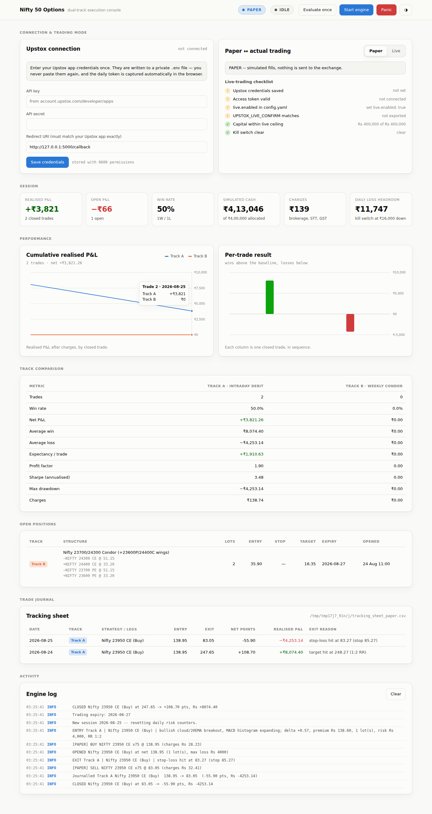
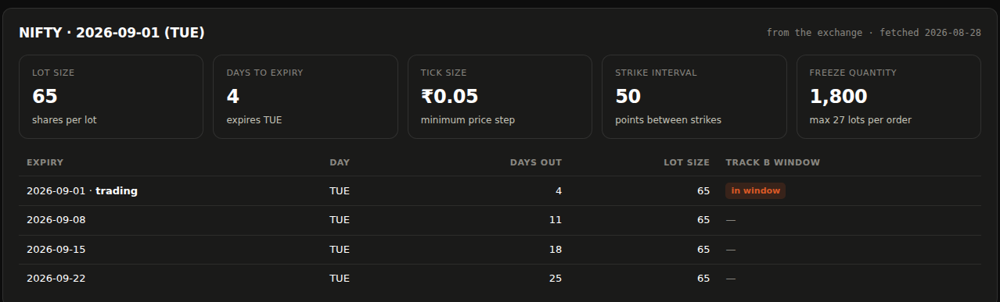
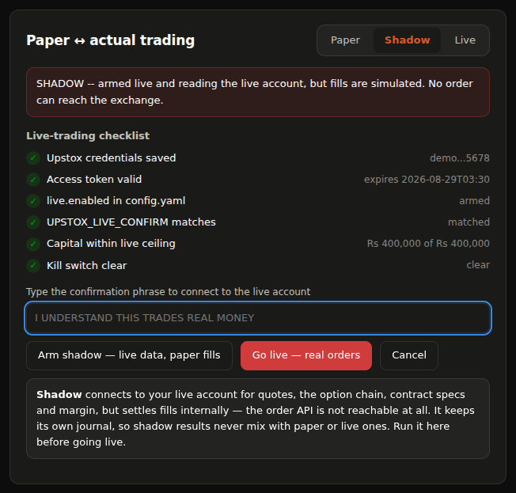

# Nifty 50 Options Strategy Framework — Upstox

Implementation of the dual-track Nifty 50 options framework in
[`docs/Nifty_50_Option_Strategies_PaperTrade_Setup.pdf`](docs/Nifty_50_Option_Strategies_PaperTrade_Setup.pdf),
running on the Upstox API.

It **paper trades by default** and switches to **actual trading** through a
single guarded switch — from a web console, or the CLI. Both modes run the
identical strategy, sizing and risk code; the only difference is where the
orders land.

```bash
pip install -r requirements.txt
python -m nifty_options dashboard      # everything below is driven from here
```



| | Track A | Track B |
|---|---|---|
| Style | Intraday debit momentum | Weekly credit decay |
| Instrument | ITM/ATM CE or PE, delta 0.50–0.60 | 4-leg iron condor, shorts at delta ~0.15 |
| Horizon | 5 min – 2 hours, squared off daily | 2–5 days, held toward weekly expiry |
| Driver | Delta expansion + MACD acceleration | Theta decay in consolidation |
| Risk | 2% of capital (₹4,000), outlay < ₹15,000 | Capped by the 100-point wings |
| Exit | MACD flattens/reverses, price back inside 20 EMA, or 1:2 target | 50–60% of credit captured, or short strike touched |

---

## Contract facts come from the exchange

Lot size, tick size, strike interval, freeze quantity and the whole expiry
calendar are read from the Upstox contract master on every session day — never
assumed in code. NSE changes all of them: the Nifty lot has been 75, 50, 25 and
65, and weekly expiry has moved between Thursday and Tuesday. Either change,
silently applied, would mis-size every order or stop a track trading entirely.



The values in `config.yaml` are **fallbacks**, used only when the API is
unreachable, and using one is logged loudly and flagged red in the page. When
the live lot size differs from the configured one, the engine warns and uses
the exchange's:

```
WARNING  Lot size changed: config had 75, the exchange lists 65 for 2026-09-01. Using 65.
INFO     Contract spec: NIFTY 2026-09-01 (TUE) | lot 65 | tick 0.05 | strikes every 50 | freeze 1800 | exchange
```

**Track B follows the calendar, not a weekday.** The document says "deploy on
Monday", which assumed a Thursday expiry — 3 days of theta. Under a Tuesday
expiry, Monday is 1 day out and that rule would never fire. `entry_days` is
empty by default, so entry is driven by the 2–5 day window against the real
listed expiries; with Tuesday expiry that lands on Thursday or Friday by
itself. Naming weekdays there still works, but re-pins the rule.

Tick size deserves a note: Upstox reports F&O ticks in paise (`5.0` meaning
₹0.05), so it is normalised on the way in — a raw read would put every limit
order at an invalid price.

## The console

`python -m nifty_options dashboard` serves the page above on
`http://127.0.0.1:5000/` and opens it. Everything is driven from there:

- **Connect Upstox in one click.** Paste the API key and secret *once*; they go
  to a private `.env` (mode 0600). The daily token is captured automatically —
  see below.
- **Flip paper ↔ live** with a live-trading checklist that shows exactly which
  guard is still blocking, and a typed confirmation phrase to arm real orders.
- **Start, stop or single-step the engine**, watch positions and the trade
  journal fill in, and hit **Panic** to engage the kill switch and flatten.
- **Cumulative P&L and per-trade results** per track, with hover detail, in
  light and dark themes.

The page polls the same process that runs the strategies, so what you see is
the engine's real state — there is no separate service and nothing leaves the
machine. Because that page can arm real trading, the server binds to loopback
only, pins the `Host` header (blocking DNS-rebinding), and requires a
per-session key on every mutating request.

## Connecting Upstox — nothing to copy or paste

Upstox tokens expire daily at 03:30 IST, so this is a chore you would otherwise
do every morning. You never handle a code or a token:

```bash
python -m nifty_options credentials     # API key + secret, stored once in .env
python -m nifty_options login           # opens the browser, captures the redirect
```

`login` starts a one-shot listener on your app's registered redirect URI, opens
the Upstox consent screen, catches the `?code=…` redirect, exchanges it for an
access token and writes it to `data/upstox_token.json` (mode 0600). When the
dashboard is running it already owns that port, so its **Connect Upstox** button
does the same thing in-page.

Register `http://127.0.0.1:5000/callback` as the redirect URI on your Upstox app
for this to work. On a headless box, `python -m nifty_options login --manual`
falls back to printing the URL and reading the code back.

---

## Three sessions, not two

| Session | Market data | Orders | Journal |
|---|---|---|---|
| **Paper** | live | simulated | `tracking_sheet_paper.csv` |
| **Shadow** | live, from your account | simulated | `tracking_sheet_shadow.csv` |
| **Live** | live, from your account | **real** | `tracking_sheet_live.csv` |

Paper already runs on live market data — quotes, the option chain and the
contract master are all real; only the fills are simulated.

**Shadow** goes one step further: it clears every live guard and connects to
your live account for quotes, chain, contract specs and margin quotes, but
settles fills internally. The order API is not merely skipped — in shadow the
engine is handed a `PaperBroker`, which has no order-placing code path at all,
so the exchange is unreachable by construction rather than by a flag.



Each session keeps its own journal and its own simulated book, so shadow
results never blend into paper or live records.

```bash
python -m nifty_options run --live --shadow   # live data, simulated fills
python -m nifty_options run --live            # real orders
```

Run shadow for a full cycle before going live: it exercises the exact code
path real trading uses — the same guards, the same contract data, the same
sizing — and produces a complete P&L record to check, without risking a rupee.

## The paper ↔ actual trading switch

Everything routes through one factory, `nifty_options.brokers.factory.build_broker`.
It returns a `PaperBroker` or a `LiveBroker`; the engine cannot tell them apart.

```
config / env / CLI  ──▶  TradingMode  ──▶  build_broker()  ──┬──▶ PaperBroker  (simulated fills)
                                              guards        └──▶ LiveBroker   (real orders)
```

### From the console

The mode switch has three states: **Paper · Shadow · Live**. Shadow and Live
both connect to your live account, so both ask for the confirmation phrase;
only Live can place an order, and only Live is painted red. The page tells you
which guard — if any — is still blocking. The engine must be stopped before the
session can change, so a running loop can never have its broker swapped
underneath it.

### Checking what will happen before you run

```bash
python -m nifty_options mode
```

```
Effective mode : PAPER
What happens   : PAPER -- simulated fills, nothing is sent to the exchange.
Journal        : data/journal/tracking_sheet_paper.csv
Kill switch    : data/KILL_SWITCH (clear)
```

### Paper trading (default)

```bash
python -m nifty_options run                 # both tracks
python -m nifty_options run --track a       # Track A only
python -m nifty_options run --once          # a single evaluation, then exit
```

Paper fills are simulated against the **live** Upstox bid/ask (crossing the
spread), with slippage and the full NSE cost stack — brokerage, STT, exchange
transaction charges, SEBI fees, stamp duty and GST — so the paper PnL in the
tracking sheet is directly comparable to what live trading would have returned.

### Switching to actual trading

Five independent things must line up. Any one of them missing keeps you in
paper mode, and the CLI tells you which one:

1. **Mode resolves to live** — `--live`, `--mode live`, `UPSTOX_TRADING_MODE=live`,
   or `mode: live` in `config.yaml` (precedence in that order).
2. **`live.enabled: true`** in `config.yaml`.
3. **`UPSTOX_LIVE_CONFIRM`** matches `live.confirmation_phrase` exactly.
4. **API credentials present** — `UPSTOX_API_KEY` and `UPSTOX_API_SECRET`.
5. **Typing `LIVE`** at the interactive prompt (bypass with `--yes` only for
   scheduled runs).

```bash
export UPSTOX_LIVE_CONFIRM="I UNDERSTAND THIS TRADES REAL MONEY"

# 1. shadow first: live account, simulated fills, full P&L record
python -m nifty_options run --live --shadow

# 2. the real thing
python -m nifty_options run --live
```

`UPSTOX_LIVE_CONFIRM` must be exported in the shell that launches the process,
before it starts — it is read once at startup, and is deliberately not stored
in a file so a committed config can never arm live on its own.

Live mode prints a banner and every order is logged at `WARNING` before it goes out:

```
================================================================
  LIVE TRADING ARMED -- ORDERS WILL USE REAL MONEY
  Capital at risk : Rs 4,00,000
  Max order value : Rs 60,000
  Dry run         : False
  Kill switch     : touch data/KILL_SWITCH
================================================================
```

### Pre-trade gate on every live order

Arming live mode is not a blank cheque. `LiveBroker` re-checks each order and
rejects it if any of these fail:

- the kill switch file exists,
- the instrument is not an NSE/BSE F&O contract,
- quantity is not a whole multiple of the lot size,
- order value exceeds `risk.live_max_order_value`,
- the daily live order count exceeds `risk.live_max_daily_orders`,
- the market is closed.

Condor legs are sent as one basket (`/v3/order/multi/place`) with the
protective long wings ordered first, so a partial fill never leaves a naked
short. If an entry fills only partially, the filled legs are unwound
immediately.

### Stopping everything

```bash
python -m nifty_options panic     # kill switch + square off every position
python -m nifty_options resume    # release the kill switch
```

The kill switch also trips automatically when the daily loss limit
(`risk.daily_loss_limit_pct`, default 4% of total capital) is breached.

---

## Setup

```bash
pip install -r requirements.txt
python -m nifty_options dashboard    # enter credentials and connect in the page
```

or entirely from the terminal:

```bash
python -m nifty_options credentials --api-key KEY --api-secret SECRET
python -m nifty_options login
python -m nifty_options run
```

Create an app at <https://account.upstox.com/developer/apps> and set its
redirect URI to match `upstox.redirect_uri` in `config.yaml`
(`http://127.0.0.1:5000/callback` by default). Only `requests` and `PyYAML` are
needed — the console is served by the standard library and loads no external
assets.

## Results and evaluation

Every closed trade is journalled in the document's section 5 format, one file
per mode (`tracking_sheet_paper.csv`, `tracking_sheet_live.csv`), so paper and
live results never blend:

| Date | Track | Strategy / Legs | Entry | Exit | Net Points | Realized PnL (₹) |
|---|---|---|---|---|---|---|
| 2026-08-25 | Track A | Nifty 24150 CE (Buy) | 112.50 | 148.00 | +35.50 | +2662.50 |
| 2026-08-25 | Track B | Nifty 24000/24300 Condor | 42.00 | 18.00 | +24.00 | +3600.00 |

```bash
python -m nifty_options report --markdown results.md
```

produces the section 4 comparison — win rate, expectancy, profit factor,
annualised Sharpe, max drawdown and charge drag per track — which is the
4-week experiment's actual output.

## Layout

```
nifty_options/
  config.py            mode resolution + live guards
  engine.py            data -> strategies -> orders -> journal
  risk.py              daily loss limit, position caps, kill switch
  journal.py           tracking sheet + evaluation metrics
  indicators.py        20 EMA, MACD(12/26/9), Ichimoku(9/26/52)
  brokers/
    factory.py         THE SWITCH
    paper.py           simulated fills, NSE cost model
    live.py            real orders + pre-trade gate
  strategies/
    track_a.py         intraday debit momentum
    track_b.py         weekly iron condor
  upstox/
    auth.py            OAuth, browser login capture, daily token handling
    client.py          REST wrapper (v2 + v3)
    contracts.py       live lot size, tick, strikes, expiry calendar
    instruments.py     delta-based strike selection
  web/
    server.py          loopback HTTP server + OAuth callback route
    controller.py      engine lifecycle, mode switch, read models
    static/            the console (no build step, no CDN)
  credentials.py       .env read/write, entered once
```

```bash
python -m pytest tests/ -q      # 195 tests, no network or credentials needed
```

---

## Notes on the specification

Three things in the source document needed a decision, all resolved
conservatively and all configurable:

1. **Track A capital.** Section 2 states ₹20,00,000 for Track A, but section 1
   allocates ₹4,00,000 total split ₹2,00,000 / ₹2,00,000, and section 3's "2%
   of capital (₹4,000)" only works against ₹2,00,000. Implemented as
   **₹2,00,000** (`track_a.capital`).
2. **Condor margin.** The document's ₹1.2–1.5 lakh for 2–3 lots is SPAN+exposure
   margin, not the wing-width max loss. Sizing asks Upstox `/charges/margin`
   for a real quote and falls back to `margin_per_lot_estimate` (₹60,000).
3. **Contract facts.** Lot size, tick size, strike interval and expiries are
   fetched from the exchange each session day (see above); `config.yaml` holds
   fallbacks only.
4. **Track B's entry day.** The document's "deploy on Monday" assumed a Thursday
   expiry (3 days of theta). NSE now lists Nifty weeklies on Tuesday, making
   Monday 1 day out and that rule dead. Entry is derived from the 2–5 day
   window against the live calendar instead, which preserves the intent under
   any expiry weekday.

Two guards were added beyond the document, because paper testing surfaced the
need: a Track A re-entry cooldown (the breakout candles are still in the window
right after an exit, so the identical setup would re-arm on the next tick) and
a Track B weekly structural-trade cap, matching "1–2 structural trades / week".
Both counts are rebuilt from the journal on startup so a restart cannot
silently reset them.

**This is trading software. Paper trade it for the full 4-week cycle described
in the document, then dry-run the live path, before letting it touch real
money.**
